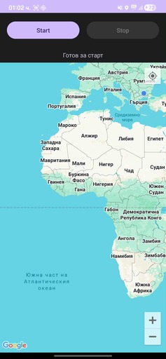
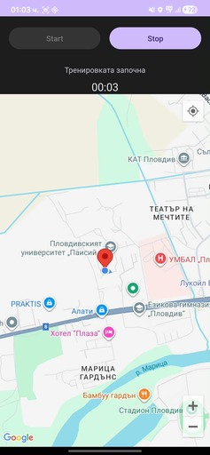
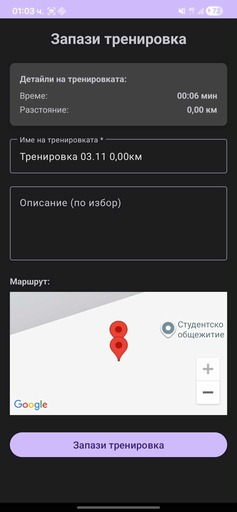

# MobileApps2025-2301321002

# Описание на проект: Running Tracker Application

---

### 1. Резюме на проекта

| Цел на проекта | Целева аудитория | Основни резултати |
| :--------------------------------------- | :----------- | :----------------------------------------------------------------------- |
| Локален начин за следене на тренировките | Активни хора | Мобилно приложение позволяващо следене на маршрута на дадена тренировка |

---

### 2. Обхват и основни функционалности

*   **Каталог на обекти:**
    *   Списък с всички записани тренировки
*   **Резервационна система:**
    *   Календар за свободни часове, създаване и управление на резервации.
*   **Административен панел:**
    *   Управление на тренировки, редактиране и изтриване.

---

### 3. Технологичен стек

*   **Сървърна част (Backend): Kotlin - MVVM архитектура
*   **Клиентска част (Frontend): Kotlin
*   **База данни (Database): FireBase

---

### 4. Как работи

*   **При стартиране на приложението се отваря началната страница, която визуализира всички тренировки (ако има такива).
*   **Всяка тренировка може да бъде избрана. Това действие ще визуализира нов прозорец който дава достъп до по подробна информация за тренировката и възможност за редактиране или изтриване на данните.
*   **Бутона "Започни нова тренировка" в горната част на началната страница визуализира нов прозорец където има 2 бутона - Start и Stop., Google Maps карта която показва текущото местоположение.
*   **П.П. При първо натискане на бутона "Започни нова тренировка" приложение изисква разрешение за достъп до текущото местоположение.
*   **При натискане на бутона Start приложението започва да отчита време и да записва текуща локация.
*   **При натискане на бутона Stop записът спира и се визуализат данните на тренировката в нов прозорец. Процеса приклюва при натискане на бутона "Запази тренировка".

---

### 5. Скрийншоти

---
